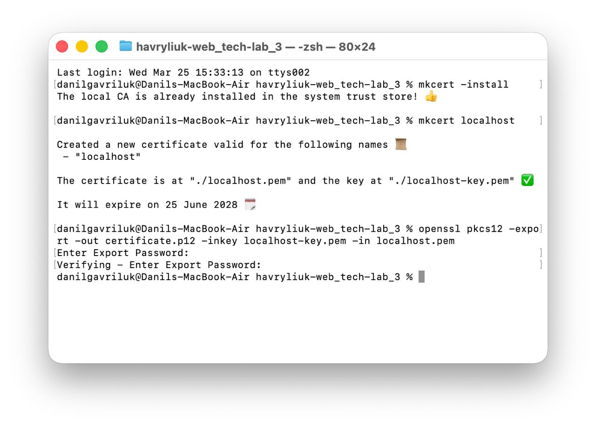
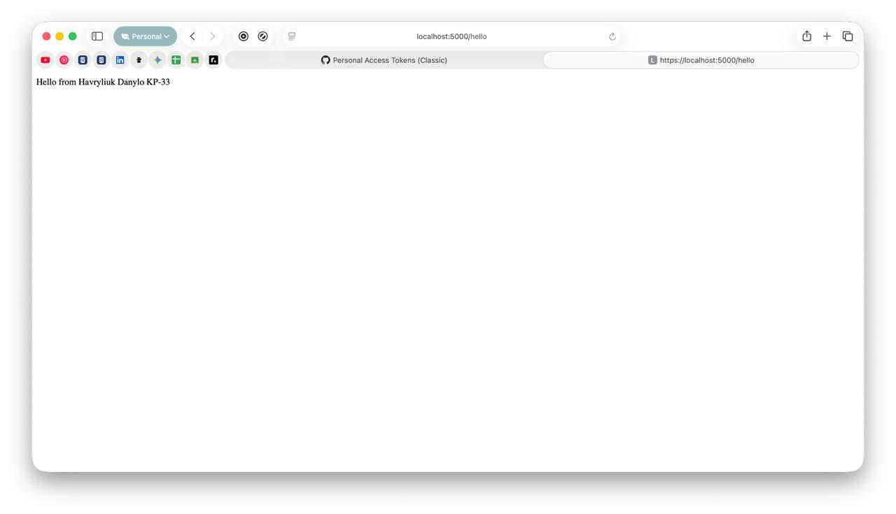
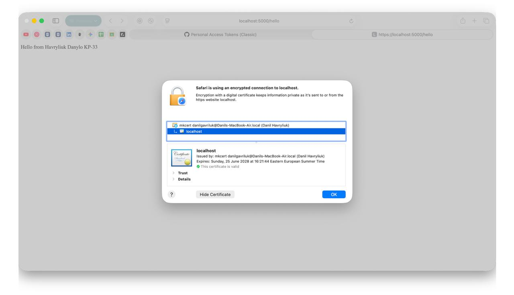
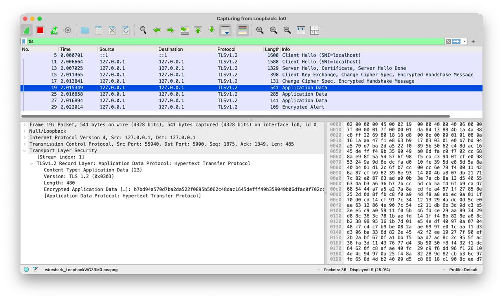
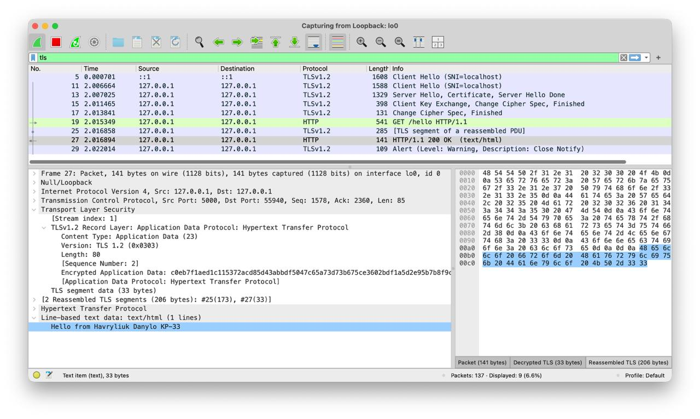

# Лабораторна робота N2: Розшифрування TLS трафіку
## Гаврилюк Данило КП-33

---

Даний проєкт демонструє створення вебсервера на Python з підтримкою HTTPS (TLS v1.2), використання сертифікатів через `mkcert` та дешифрування `TLS` трафіку за допомогою Wireshark.

## 🛠 Технологічний стек
* **Мова програмування:** Python 3.13
* **Фреймворк:** Flask
* **Інструменти:** mkcert, OpenSSL, Wireshark
* **ОС:** macOS

---

## 🚀 Хід виконання роботи

### 1. Генерація сертифікатів
Для створення довіреного локального CA та сертифіката використано утиліту `mkcert`. Оскільки за завданням необхідний формат `.p12`, було виконано конвертацію через OpenSSL.

Конвертація через OpenSSL є необхідним кроком для створення універсального захищеного контейнера, який вимагається специфікацією завдання та 
підтримується аналізаторами трафіку, такими як Wireshark, для зручного імпорту всієї криптографічної пари одним об'єктом.

### 2. Розробка вебсервера

Сервер реалізовано на `Flask`. Основна увага приділена налаштуванню `ssl.SSLContext` для дотримання вимог:

- Версія протоколу: `TLS v1.2`.
- Cipher Suites: Використано виключно `RSA` алгоритми (наприклад, AES128-SHA), щоб забезпечити можливість дешифрування у Wireshark за допомогою закритого ключа.

#### Ендпоінт: https://localhost:5000/hello
#### Формат відповіді: Hello from [ПІБ] [Група]

#### Виклик ендпоінту в браузері:

На скріншотах видно розроблений endpoint та підтвердження використання сертифіката від mkcert.

### 3. Налаштування Wireshark

Для розшифрування трафіку у Wireshark було виконано наступні кроки:

1. Додано `.p12` файл у `Preferences -> Protocols -> TLS -> RSA Keys List`.
2. Оскільки використовується нестандартний порт, активовано функцію Decode As -> TLS для порту 5000.

---

### 4. Результати в Wireshark

#### Перехоплення трафіку (до налаштування ключів)

>Трафік відображається як `Application Data` (зашифрований):

#### Розшифрований трафік у Wireshark

>Видно HTTP-відповідь "Hello from Havryliuk Danylo KP-33" у відкритому вигляді після застосування ключа, 
а також самі http-запити в колонці `Info` замість просто `Application Data`:

---

### Висновоки

У ході виконання лабораторної роботи було отримано практичні навички налаштування захищеного 
з'єднання за протоколом HTTPS для вебсервера на базі Python та генерації сертифікатів. Шляхом конфігурації сервера на використання протоколу TLS v1.2 
та алгоритмів сімейства RSA було забезпечено технічну можливість для подальшого аналізу мережевого 
трафіку. Використання інструменту Wireshark дозволило успішно здійснити дешифрування переданих 
пакетів у реальному часі.